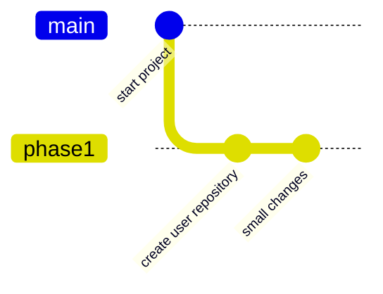

# ApiSmall
----------------------

Create and develop an api-rest with implementation in a __MYSQL__ database adding a layer of __Spring Security__ for a correct web service endpoint about user data. Support for json data is also included, taking into account the handling of possible errors in a call from an endpoint and so this app can be deployed in ___Amazon Cloud___

Finally, perform the data inputs verifications using test tools such as __Junit + JWT__ token that will be exposed in a respective documentation in __Swagger__

----------------------
#### Phase1:
* Star project defining the basic path of an Api ResT
* Use the post tool with the intention of seeing the logs when calling a path
* Proceed to create the model classes from input to output of a user's data
* Create the interfaces to define the signatures that are implemented in the ServiceUser class
* Add Runtime exepction in case of duplicate errors, one registration by one user

